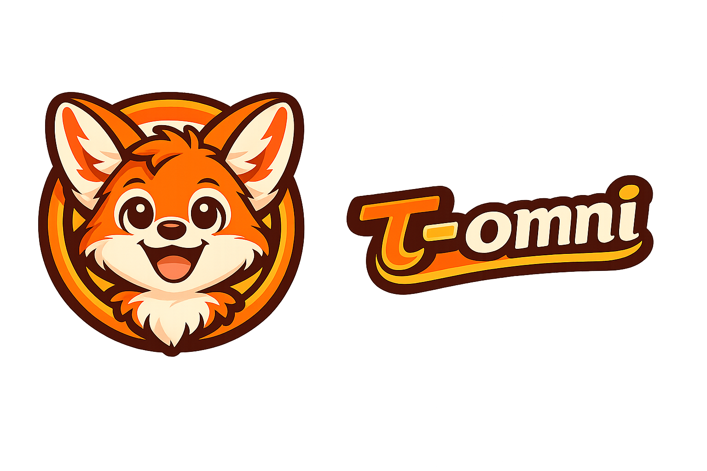

<div align="center">
  
  <h1>τ-OMNI: Trajectory-Centric Omni Reward–Policy Co-evolution</h1>
  <p>
    
    

  <a href="https://your-website.com">
    
  </a>

  <a href="https://your-username.github.io/your-repo/">
    
  </a>
    
  </p>
</div>

<div align="center" style="font-family: 'Palatino Linotype', 'Book Antiqua', Palatino, serif; line-height: 1.8;">

在强化学习中，**τ** 通常表示一条轨迹，用以刻画策略与环境之间的交互过程。

实际上，**τ** 不仅是交互的记录，更是行动与评价之间不断协商与对齐的结构化痕迹。

在此之上，**τ** 可被视为策略与奖励共同演化的最小单元：行为在其上展开，反馈在其上生成。

🧩 **τ-OMNI** 目标是：使 τ 成为驱动学习过程的核心载体，实现奖励与策略的协同进化。

---
</div>

## 📢 News

- **2026-04** 🚀 Our paper **DualRM** has been accepted to ACL 2026 (Main Conference).

## Table of Contents

- [Architecture](#️-architecture)
- [Install](#-install)
- [Quick Start](#-quick-start)
- [Recipes](#-recipes)

## 🏗️ Architecture

## 📦 Install

**1. 📌 Prerequisites**

Tau-Omni builds upon the following core frameworks:

- **Verl：** 🔗 https://verl.readthedocs.io/en/latest/start/install.html  

- **LLaMAFactory：**  🔗 https://github.com/hiyouga/LlamaFactory

**2. 📥 Clone Repository**

```bash
> conda create -n tau-omni python=3.10 -y
> conda activate tau-omni
> git clone https://github.com/dropreg/Tau-omni.git
> cd Tau-omni
> pip install -r requirements.txt
```

## 🚀 Quick Start

**τ-OMNI** 支持从数据合成、奖励建模到策略训练的完整闭环流程（closed-loop pipeline），  
不同方法与配置可参考 `Recipes` 模块。

典型流程包括：

1. **数据合成（Data Synthesis）** – 构建高质量训练数据或轨迹  
2. **奖励建模（Reward Modeling）** – 学习对轨迹或输出的奖励函数  
3. **策略训练（Policy Training）** – 在奖励信号指导下优化模型


## 🧩 Recipes

| Recipe    | What it does | README |
| --------- | --- | --- |
| [`Generative RM`](recipes/gen_rm/) | 通过生成式奖励模型来进行训练和推理 | [`README`](recipes/gen_rm/README.md) |
| [`r1_reward`](recipes/r1_reward/) | 基于 RM-R1 / R1-Reward 思路，用 verl/GRPO 训练 reasoning-based reward model。 | [`README`](recipes/r1_reward/README.md) |
| [`rrm`](recipes/rrm/) | Reward Reasoning Modeling，训练输出推理过程和最终偏好判断的奖励模型。 | [`README`](recipes/rrm/README.md) |
| [`dual_rm`](recipes/dual_rm/) | Dual Reward Model / meta-reward 训练示例，结合 reward model 和 agent loop。 | [`README`](recipes/dual_rm/README.md) |
