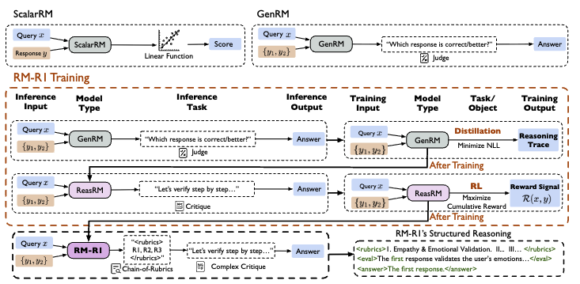

# R1-Reward Recipe

[返回 Tau-omni 主页](../../README.md)

R1-Reward 是一个基于 verl/GRPO 训练生成式奖励模型的 recipe。它的核心目标是把 reward model 从“直接打分”的 ScalarRM，转成“先推理、再判断”的 GenRM：模型读取用户问题和两个候选回答，输出分析过程，并在最后给出可验证的偏好结论 `[[A]]` 或 `[[B]]`。

## 基于强化学习的生成式奖励模型训练

<p align="center">
  
</p>

这个 recipe 主要参考 RM-R1。该工作将 Reward Modeling 从“打分问题”重新建模为“推理问题”，引入 Reasoning Reward Models，使模型在给出判断前先进行显式推理，从而提升性能与可解释性。

RM-R1 通过 **推理蒸馏 + 强化学习** 的两阶段训练，并引入 Chain-of-Rubrics（CoR）机制，让模型能够根据任务动态生成评价标准，或者先完成分析再给出判断。实验结果表明，RM-R1 在多个 Reward Benchmark 上都表现出较强性能，能够用更小的模型取得接近甚至超过大模型的效果，同时输出更结构化、可解释的判断过程。

## 数据流

当前使用流程比较简单，主要分为两步：

1. **下载数据**

   先下载 Skywork 数据集：

   ```bash
   bash recipes/modelscope_data/run.sh
   ```

2. **训练模型**

   再启动训练：

   ```bash
   bash recipes/r1_reward/r1_rm_train.sh
   ```

## 参考论文

- [RM-R1: Reward Modeling as Reasoning](https://arxiv.org/abs/2505.02387), arXiv:2505.02387.
- [R1-Reward: Training Multimodal Reward Model Through Stable Reinforcement Learning](https://arxiv.org/abs/2505.02835), arXiv:2505.02835.
